# AWS re/Start Project: Custom VPC, Secured Linux Web Server & Automated S3 Backups

A hands-on project built during the **AWS re/Start program**, combining skills from the **Cloud Foundations**, **Linux**, and **Networking** modules of the AWS Certified Cloud Practitioner track.

## Overview

This project involved designing a custom network from scratch, deploying a secured Linux web server inside it, and automating backups of its logs to Amazon S3 on a schedule — a small but realistic slice of how cloud infrastructure is actually built and maintained.

## Skills Demonstrated

**Cloud Foundations**
- Amazon EC2 instance provisioning
- Amazon S3 bucket creation and object storage
- IAM roles for secure, credential-free service-to-service access
- Applying the AWS Shared Responsibility Model in practice

**Linux**
- User and group management (`useradd`, `groupadd`, `usermod`)
- File permission and ownership management (`chmod`, `chown`) following least-privilege principles
- Bash shell scripting for automation
- Service management with `systemctl`
- Process monitoring (`ps`, `systemctl status`)
- Log file review and analysis

**Networking**
- Designing a custom VPC with a public subnet, internet gateway, and route table
- Understanding public vs. private IP addressing
- Network troubleshooting commands (`ip addr`, `curl`, `traceroute`, `ping`)

## Architecture

```
Internet
   │
Internet Gateway
   │
Custom VPC (10.0.0.0/16)
   │
Public Subnet
   │
EC2 Instance (Amazon Linux, Apache web server)
   │
   ├── Cron job (scheduled daily)
   │      │
   │      └── Bash script → compresses logs → uploads to S3
   │
   └── S3 Bucket (versioned, stores log backups)
```

## Step-by-Step Walkthrough

### 1. Built a custom VPC
Created a VPC with a public subnet, internet gateway, and route table using the AWS VPC wizard.

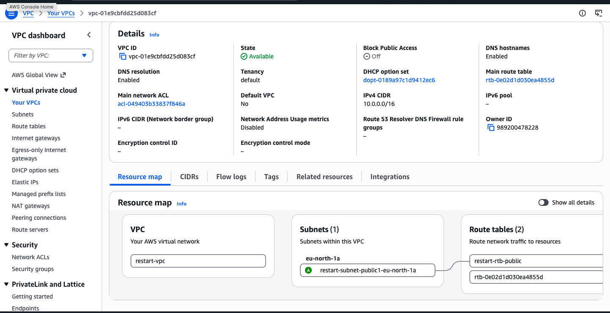

### 2. Launched an EC2 instance inside the VPC
Deployed an Amazon Linux t2.micro instance into the custom public subnet with a public IP enabled.

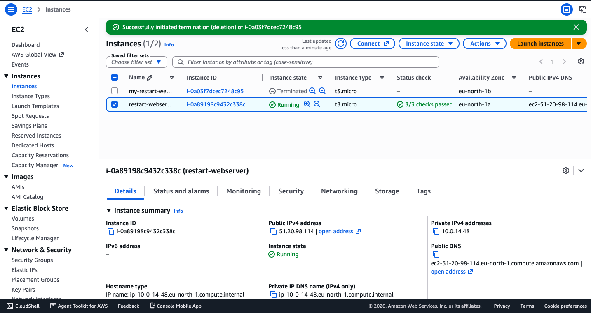

### 3. Connected via SSH
Connected to the instance securely using a key pair.

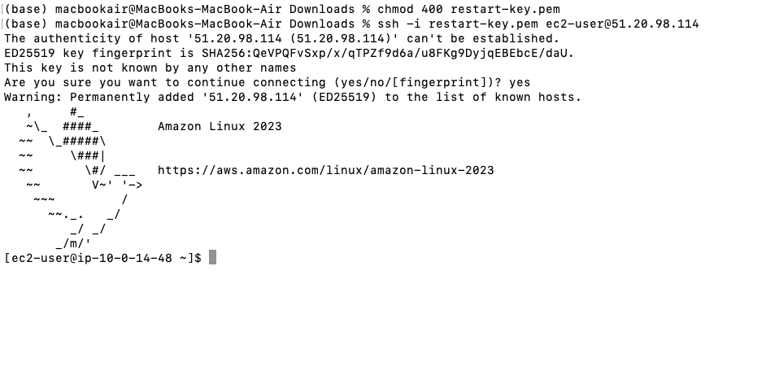

### 4. Created a non-root user and group
Set up a `webadmin` user and `webteam` group to demonstrate proper user/group management instead of relying on root.

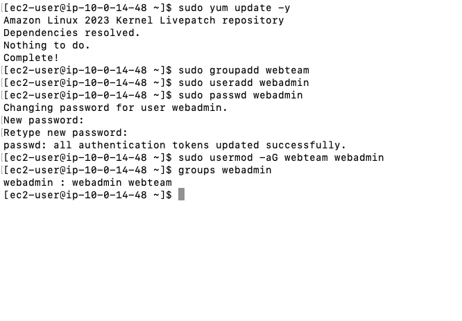

### 5. Installed and started Apache
Installed `httpd`, started and enabled the service, and confirmed it was running.

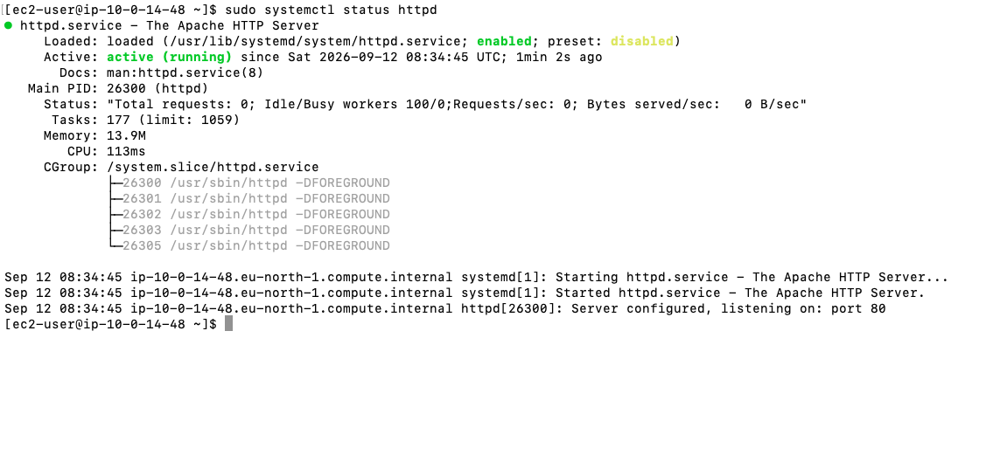

### 6. Deployed a custom webpage
Created a simple homepage and confirmed it was reachable over the internet.

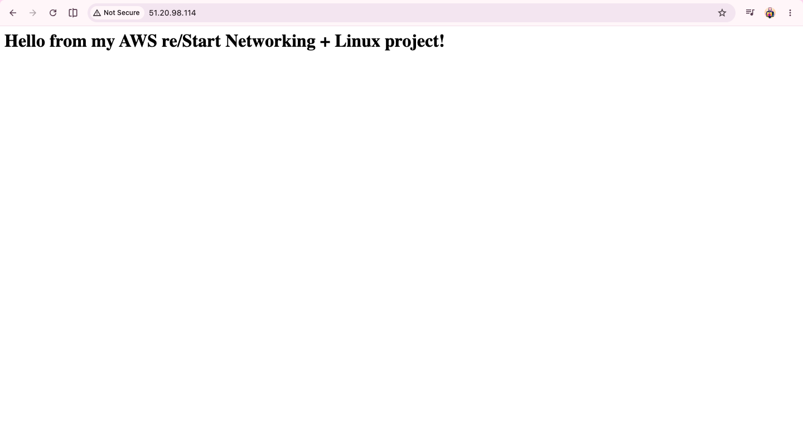

### 7. Locked down file permissions
Applied least-privilege ownership and permissions to the web root, adding the `apache` user to the `webteam` group so the server could still serve files.

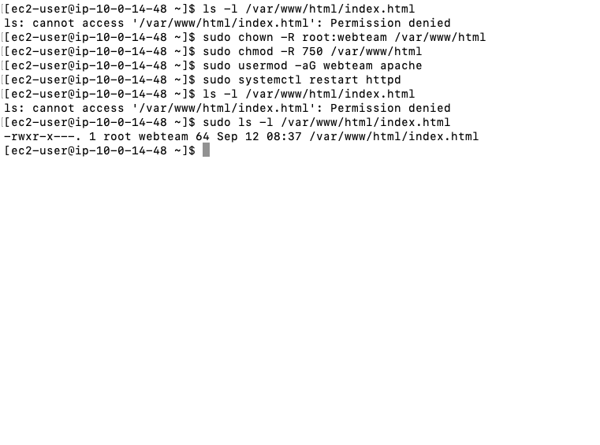

### 8. Created an S3 bucket
Set up a versioned S3 bucket (`my-restart-backups`) to store log backups.

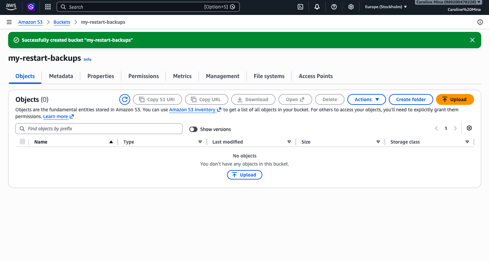

### 9. Configured an IAM role
Attached an IAM role to the EC2 instance so it could upload to S3 without storing any credentials on the machine.

### 10. Wrote a backup automation script
Wrote a bash script that compresses the Apache log directory and uploads it to S3.

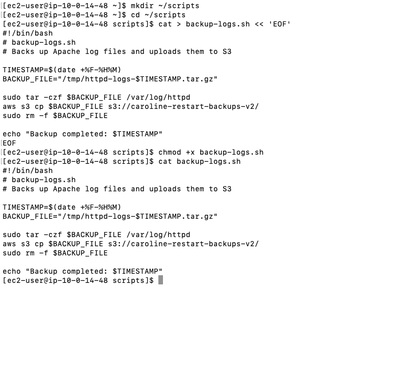

```bash
#!/bin/bash
# backup-logs.sh
# Backs up Apache log files and uploads them to S3

TIMESTAMP=$(date +%F-%H%M)
BACKUP_FILE="/tmp/httpd-logs-$TIMESTAMP.tar.gz"

sudo tar -czf $BACKUP_FILE /var/log/httpd
aws s3 cp $BACKUP_FILE s3://my-restart-backups/
sudo rm -f $BACKUP_FILE

echo "Backup completed: $TIMESTAMP"
```

Tested the script manually and confirmed a clean run with no errors.

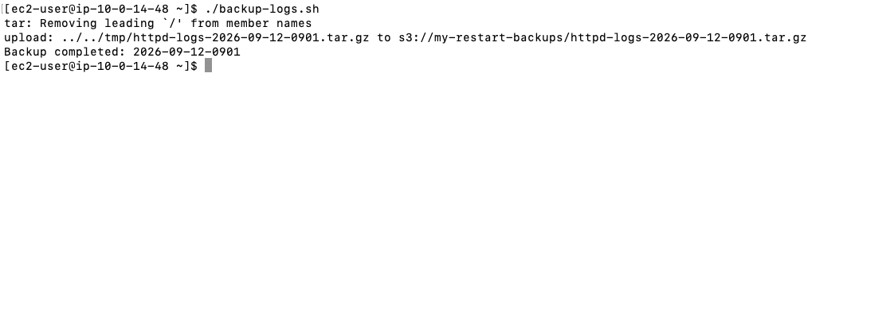

Confirmed the backup landed in S3.

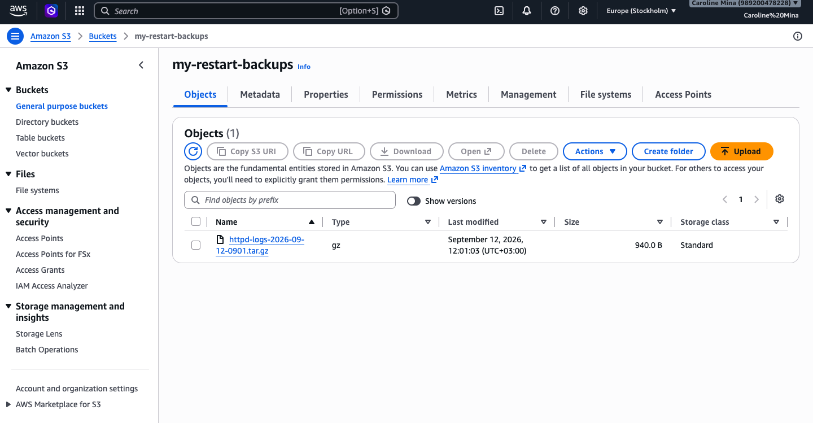

### 11. Scheduled the backup with cron
Installed and configured `cron` to run the backup script automatically every day at 2 AM.

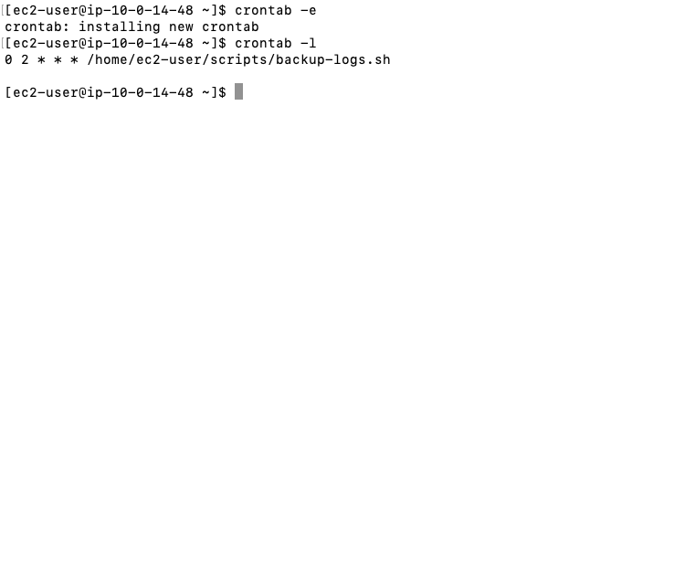

### 12. Practiced networking troubleshooting
Used core networking commands (`ip addr`, `curl`, `traceroute`) to inspect the instance's IP configuration and confirm its route out to the internet.

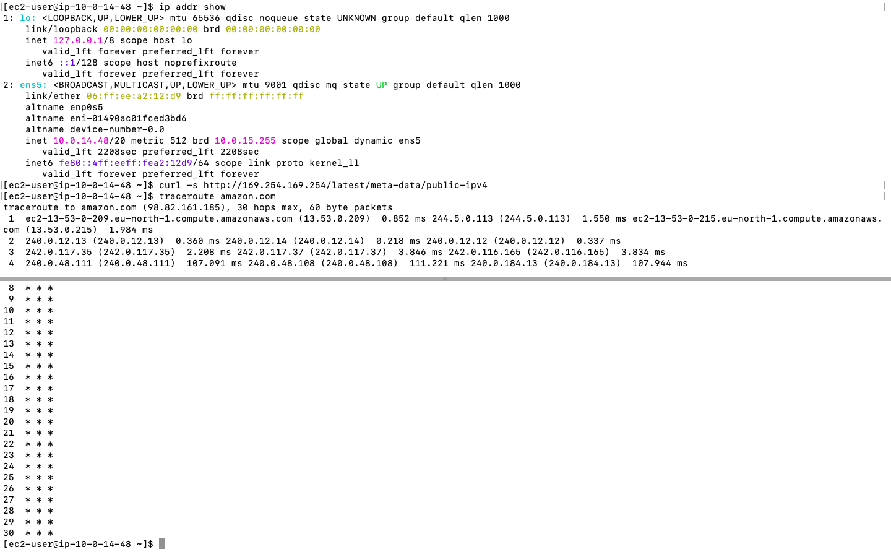

Verified basic internet connectivity from the instance.

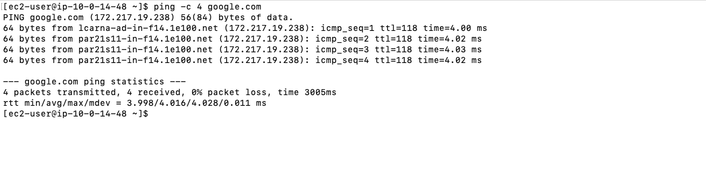

### 13. Monitored processes and reviewed logs
Checked the web server's running processes and reviewed/analyzed its access logs.

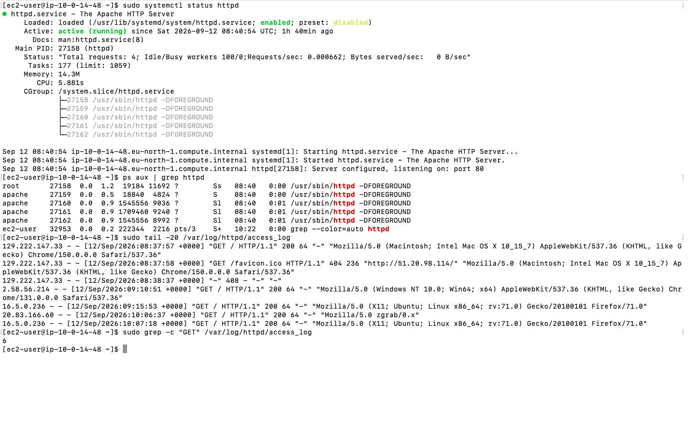

## What I Learned

Building this project reinforced how the different AWS re/Start modules connect in practice — networking decisions (like VPC and subnet design) directly affect how a server is reached, Linux fundamentals (permissions, users, scripting) are what actually secure and automate a server day-to-day, and AWS services like S3 and IAM tie it all together securely. Debugging real issues along the way — like permission lockouts and bucket naming — taught me more than following the steps perfectly would have.

## Cleanup

All resources (EC2 instance, S3 bucket, and VPC) were terminated/deleted after completing this project to avoid ongoing charges.
